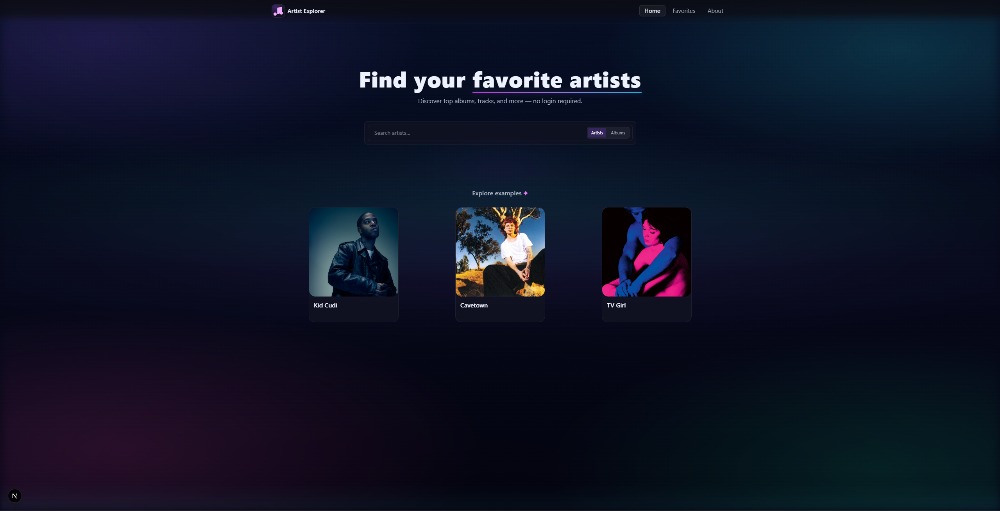
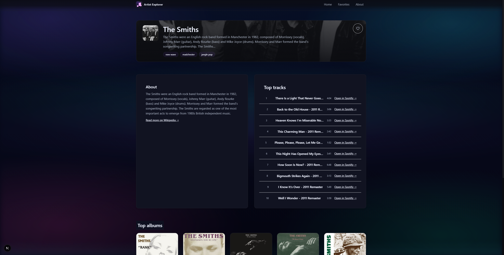
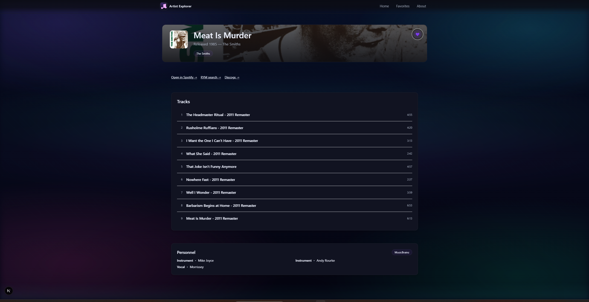

# 🎵 Artist Explorer

**Artist Explorer** is a modern, full-stack web app built with **Next.js 13, TypeScript, and Tailwind CSS**.
It lets users **search artists & albums**, explore detailed pages, and save favorites — all wrapped in a sleek, responsive UI.

This project demonstrates my ability to build **production-grade React/Next.js applications** with a strong focus on **API design, type safety, and UI/UX polish**.

---

## 🌐 Live Demo

👉 [Artist Explorer on Vercel]([https://artist-explorer.vercel.app])

---

## 🌟 Why This Project?

I created Artist Explorer as a way to practice **modern web app architecture** with Next.js 13’s App Router, TypeScript strict mode, and a custom API layer.

It showcases my skills in:

* ✅ **Frontend engineering** – interactive search UI, responsive design, accessibility
* ✅ **Backend integration** – REST APIs for artists/albums, environment-based secrets
* ✅ **Full-stack workflows** – combining data fetching, UI components, and persistence
* ✅ **Clean code practices** – modular components, reusable hooks, strong typing

> This project is part of my portfolio to highlight **practical, real-world development** with today’s most in-demand tools.

---

## 🚀 Features

* 🔍 **Search Artists & Albums** with category toggle
* 🎤 **Artist Pages** – details, images, related content
* 💿 **Album Pages** – tracklist and credits
* ❤️ **Favorites** with persistent storage
* ⚡ **Fast & responsive** via Next.js server components
* 🎨 **Modern UI** with Tailwind CSS and custom design system
* 🔧 **TypeScript strict mode** for full type safety
* 🛠️ **Custom API routes** for searching and retrieving data

---

## 🖼️ Screenshots

*(replace with actual screenshots once you run the app)*

| Search View                                         | Artist Page                                         | Album Page                                        |
| --------------------------------------------------- | --------------------------------------------------- | ------------------------------------------------- |
|  |  |  |

---

## 🏗️ Tech Stack

* **Framework**: Next.js 13 (App Router)
* **Language**: TypeScript (strict mode)
* **UI**: React 18 + Tailwind CSS
* **Build Tools**: PostCSS, ESLint
* **APIs**: Custom REST routes (search, artist, album, credits)
* **Other**: Environment variables via `.env.local`

---

## 📂 Project Structure

```
Artist Explorer/
├── public/               # Static assets (logo, screenshots, etc.)
├── src/
│   ├── app/              # Next.js App Router (pages & API)
│   │   ├── api/          # REST API routes
│   │   ├── artist/       # Artist detail pages
│   │   ├── album/        # Album detail pages
│   │   ├── favorites/    # Favorites page
│   │   └── layout.tsx    # Root layout
│   ├── components/       # Reusable UI components
│   └── hooks/            # Custom React hooks
├── package.json          # Scripts & dependencies
├── tailwind.config.ts    # Tailwind setup
├── tsconfig.json         # TypeScript config
└── .env.local            # Environment variables
```

---

## ⚙️ Setup & Installation

1. **Clone the repo**

   ```bash
   git clone https://github.com/your-username/artist-explorer.git
   cd artist-explorer
   ```

2. **Install dependencies**

   ```bash
   npm install
   # or
   yarn install
   ```

3. **Configure environment variables**
   Create `.env.local` with your Spotify credentials:

   ```ini
   SPOTIFY_CLIENT_ID=your_client_id
   SPOTIFY_CLIENT_SECRET=your_client_secret
   ```

4. **Run the dev server**

   ```bash
   npm run dev
   ```

   Open [http://localhost:3000](http://localhost:3000).

5. **Build for production**

   ```bash
   npm run build
   npm start
   ```

---

## 🔑 Available Scripts

* `npm run dev` – Development server
* `npm run build` – Build for production
* `npm run start` – Start production server
* `npm run lint` – Run ESLint checks

---

## 📖 API Endpoints

* `GET /api/search/artists?q=` – Search for artists
* `GET /api/search/albums?q=` – Search for albums
* `GET /api/artist/[id]` – Artist details
* `GET /api/album/[id]` – Album details
* `GET /api/album/[id]/credits` – Album credits

---

## 🤝 Contributing

1. Fork the repo
2. Create a feature branch (`git checkout -b feature/my-feature`)
3. Commit changes (`git commit -m 'Add feature'`)
4. Push branch (`git push origin feature/my-feature`)
5. Open a Pull Request

---

## 📜 License

MIT – feel free to use and adapt.

